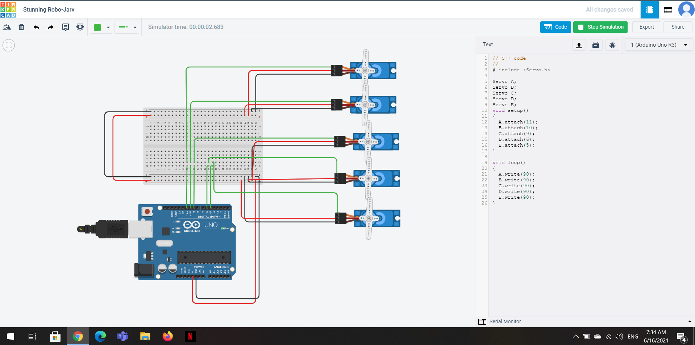

# An-Arduino-circuit-controlling-5-Servo-motor
An Arduino circuit controlling 5 Servo-motor simulated in TinkerCad (circuit and code)

 **1. The code**  

```ruby
// C++ code  
//  
# include <Servo.h>  

Servo A;
Servo B;
Servo C;
Servo D;
Servo E;  

void setup()  
{ A.attach(11);
  B.attach(10);
  C.attach(9);
  D.attach(6);
  E.attach(5);  }  
  

void loop()  

{ A.write(90);
  B.write(90);
  C.write(90);
  D.write(90);
  E.write(90);  }
  ```  
  
 **2. The circuit**  
   
   
 
 
 
  **3. The simulation design**  
  
   [Click here to show the project in TinkerCad](https://www.tinkercad.com/things/1HIFasACAva)
  
